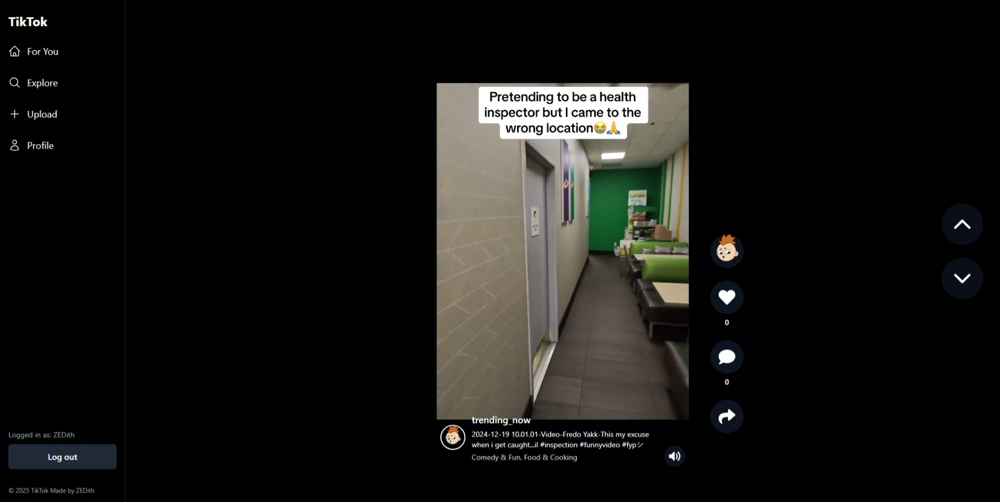

# 🎥 TikTok Clone - Advanced Video Platform (Full Stack Moderation & Recommendation System)

<div align="center">
  
</div>

An open-source video sharing platform with a fully implemented content moderation and recommendation systems. Built with FastAPI, React, and AI-powered features. Project featuring a complete content moderation system, user preference tracking, and self-training video recommendation engine.

[](https://www.python.org/downloads/)
[](https://fastapi.tiangolo.com/)
[](https://reactjs.org/)
[](LICENSE)
##
### 🛠️ Prerequisites
- Python 3.12+
- Node.js 16+
- FFmpeg
- Google AI Studio Account (for Gemini AI)


## 🌟 Features

### 🤖 Advanced Content Moderation
- **Video Moderation**: Real-time video content analysis using Google's Gemini AI
  - Detects inappropriate content, violence, hate speech
  - Automatic content categorization
  - Configurable moderation thresholds

  **🎥 Video Moderation System**
  
  Our platform implements AI-Powered Preemptive Content Moderation with a hybrid approach:

  1. **Automated Analysis**
     - Pre-publication screening of all videos
     - Deep content analysis using Gemini AI
     - Multi-stage moderation pipeline
     - Detailed violation logging and explanations
  
  2. **Key Strengths**
     - ✅ Fully Automated & Scalable
     - ✅ Deep Content Analysis (visuals, speech, text)
     - ✅ Detailed Explainability
     - ✅ Robust Retry Mechanisms
     - ✅ Customizable Safety Policies
  
  3. **Hybrid Review System**
     - AI-based initial screening
     - Human override capability through admin panel
     - Future: LLM Judge for complex cases
  
  4. **Implementation Features**
     - Preemptive Filtering: Blocks unsafe content before publication
     - Confidence-Based Classification: Threshold-based moderation
     - Multi-Stage Pipeline: AI screening → Human review if needed
     - Reinforcement Learning: System improves through feedback
     - Database Logging: Tracks all moderation decisions

  5. **Industry-Standard Approach**
     - Similar to YouTube's Content ID
     - Comparable to TikTok & Facebook AI Moderation
     - Scalable from small to medium platforms
     - Extensible for enterprise-level needs

- **Comment Moderation**: [DistilBERT-based moderation model](https://huggingface.co/Vrandan/Comment-Moderation) running 24/7
  - Multi-label classification with 95.4% accuracy
  - Real-time moderation with confidence scores
  - Lightweight deployment (67M parameters)
  - Background processing of all comments
  
  **📊 Content Categories**
  
  | Category | Label | Definition |
  |----------|--------|------------|
  | Sexual | `S` | Content meant to arouse sexual excitement, such as the description of sexual activity, or that promotes sexual services (excluding sex education and wellness). |
  | Hate | `H` | Content that expresses, incites, or promotes hate based on race, gender, ethnicity, religion, nationality, sexual orientation, disability status, or caste. |
  | Violence | `V` | Content that promotes or glorifies violence or celebrates the suffering or humiliation of others. |
  | Harassment | `HR` | Content that may be used to torment or annoy individuals in real life, or make harassment more likely to occur. |
  | Self-Harm | `SH` | Content that promotes, encourages, or depicts acts of self-harm, such as suicide, cutting, and eating disorders. |
  | Sexual/Minors | `S3` | Sexual content that includes an individual who is under 18 years old. |
  | Hate/Threat | `H2` | Hateful content that also includes violence or serious harm towards the targeted group. |
  | Violence/Graphic | `V2` | Violent content that depicts death, violence, or serious physical injury in extreme graphic detail. |
  | Safe Content | `OK` | Appropriate content that doesn't violate any guidelines. |

  Our implementation runs continuously in the background, processing new comments as they're posted. The moderation system:
  - Provides instant feedback on comment submission
  - Shows detailed violation categories in admin panel
  - Allows manual review of flagged content
  - Maintains high throughput with minimal resource usage
  - Features human override capability through admin panel
  - Planned: AI Judge system using LLMs for complex moderation cases and validation

### 🎯 Smart Recommendation System

- **Content-Based Filtering with Category Similarity & Engagement Ranking**
  - Category Matching: Recommends videos based on user preferences
  - TF-IDF & Cosine Similarity: Advanced category similarity computation
  - Engagement-Based Ranking: Prioritizes high-engagement content
  - Hybrid Strategy: Balances familiar and new content to prevent content bubbles
  - Exclusion of Watched Videos: Prevents duplicate recommendations

- **Algorithm Breakdown**:
  ```python
  final_score = (category_similarity * 0.7) + (engagement_score * 0.3)
  ```
  - TF-IDF vectorization for category analysis
  - Cosine similarity for content matching
  - Weighted scoring system favoring category relevance

### 🎲 Recommendation Strategy: Hybrid Exploration-Exploitation

- **Epsilon-Greedy Exploration**
  ```python
  recommendations = [
      *get_personalized_recommendations(8),  # Exploitation: 80%
      *get_random_recommendations(2)         # Exploration: 20%
  ]
  ```
  - Exploitation (80%): 8 personalized videos based on user preferences
  - Exploration (20%): 2 random videos for content discovery
  - Dynamic adjustment based on user engagement

- **Key Components**:
  - 🎯 **Exploitation**: Content-based filtering with engagement ranking
  - 🎲 **Exploration**: Random video injection for discovery
  - 🔄 **Serendipitous Discovery**: Breaking content bubbles
  - 📊 **Thompson Sampling**: Adaptive exploration rates

- **Strategic Benefits**:
  - Prevents filter bubbles and content stagnation
  - Enables trend discovery and interest expansion
  - Balances familiarity with novelty
  - Improves cold-start user engagement

- **Implementation Advantages**:
  - 🔍 Prevents Repetitive Content
  - 📈 Encourages Trend Discovery
  - ⚖️ Balances Personalization & Diversity
  - 🆕 Effective for New Users

- **Key Advantages**:
  - 🎯 Personalized Recommendations
  - 🔒 Privacy-Friendly (No user data sharing)
  - 🆕 No Cold Start Problem
  - 📈 Daily Model Updates
  - ⚡ Computationally Efficient

- **Daily Model Training**: Self-improving recommendation engine
  - Updates every 24 hours with new user interactions
  - Considers views, likes, and comments
  - Category-based content matching

### 🔄 Recommendation Model Training

Our platform implements a Hybrid Content-Based Recommendation System that combines TF-IDF Vectorization, Cosine Similarity, and Engagement Ranking:

**🎯 Training Pipeline**
```python
# Runs daily at 3 AM in backend_constant
def train_recommendation_model():
    # 1. Load video data with engagement metrics
    df = load_video_data_from_mysql()
    
    # 2. Create category similarity matrix
    vectorizer = TfidfVectorizer()
    category_matrix = vectorizer.fit_transform(df['category'])
    similarity_matrix = cosine_similarity(category_matrix)
    
    # 3. Calculate engagement scores
    df['engagement_score'] = (
        df['likes'] * 1.0 +
        df['comments'] * 2.0 +
        df['views'] * 0.5
    ).pipe(lambda x: (x - x.min()) / (x.max() - x.min()))
    
    # 4. Save model artifacts
    save_model({
        'vectorizer': vectorizer,
        'similarity_matrix': similarity_matrix,
        'video_data': df,
        'trained_at': datetime.now()
    })
```

**🔍 Key Components**

1. **Content-Based Filtering**
   - TF-IDF category vectorization
   - Cosine similarity computation
   - Category-based video matching
   - Similar to Netflix's movie matching

2. **Engagement Ranking**
   - Weighted interaction scoring
   - View/Like/Comment analysis
   - Normalized engagement metrics
   - Inspired by TikTok's ranking

3. **Batch Processing**
   - Daily model retraining
   - Precomputed similarity scores
   - Efficient recommendation serving
   - Like Amazon's batch updates

**💪 System Strengths**

- ✅ Privacy-First Design (No User Tracking)
- ✅ Instant Cold Start Handling
- ✅ Computationally Efficient
- ✅ Daily Self-Improvement
- ✅ Easy to Debug and Maintain

**🔄 Evolution Path**

As we collect more user interaction data, we plan to evolve toward a Monolith-like system:

1. **Current Phase: Content-Based**
   ```python
   score = (
       similarity_score * 0.7 +
       engagement_score * 0.3
   )
   ```
   - Category-based matching
   - Basic engagement metrics
   - Daily batch updates

2. **Next Phase: Enhanced Hybrid**
   ```python
   score = (
       similarity_score * 0.5 +
       user_embedding * 0.3 +
       temporal_score * 0.2
   )
   ```
   - User embeddings
   - Time-decay factors
   - A/B testing framework

3. **Future: Monolith-Style**
   ```python
   score = deep_learning_model(
       user_features,
       content_features,
       context_features
   )
   ```
   - Deep learning models
   - Real-time processing
   - Multi-modal analysis

**📊 Industry Comparison**

| Feature | Our System | ByteDance Monolith |
|---------|------------|-------------------|
| Training Frequency | Daily Batch | Real-time |
| Computational Need | Low (CPU) | High (GPU Clusters) |
| Cold Start | Instant | Requires History |
| Privacy | High | Lower |
| Scalability | Medium | Global Scale |
| Implementation | Simple | Complex |
| Infrastructure | Basic | Enterprise |

**🎯 Why This Approach?**

1. **Perfect for Growth Stage**
   - Start with efficient, simple system
   - Collect quality interaction data
   - Build toward ML sophistication
   - Validate recommendation strategy

2. **Resource Optimization**
   - Daily training is cost-effective
   - Minimal infrastructure needed
   - Easy to monitor and adjust
   - Clear upgrade path

3. **Data Foundation**
   - Builds clean interaction history
   - Creates category relationships
   - Enables future ML training
   - Maintains user privacy

The system runs daily in `backend_constant/constant_run.py`, continuously improving recommendations while preparing for future scaling to more sophisticated approaches like ByteDance's Monolith.

### 🧠 User Preference Analysis System

Our platform implements an AI-Powered User Preference Learning system that runs 24/7 in the background:

**🔄 Continuous Learning Pipeline**
```python
# Runs daily at 4 AM in backend_constant
def analyze_user_preferences():
    # 1. Fetch last 30 days of user interactions
    interactions = fetch_user_interactions()
    
    # 2. Group by user and category
    for user in users:
        category_stats = [
            f"Category: {cat}\n"
            f"Views: {stats['views']}\n"
            f"Likes: {stats['likes']}\n"
            f"Comments: {stats['comments']}"
            for cat, stats in user.categories
        ]
    
    # 3. AI-based category suggestions
    categories = gemini_ai.analyze(
        user_data=category_stats,
        max_categories=3
    )
```

**🎯 Key Components**

1. **Raw Interaction Analysis**
   - Tracks all user interactions
   - Collects 30-day engagement history
   - Groups data by category
   - Preserves detailed metrics

2. **AI-Powered Categorization**
   - Uses Gemini AI for pattern recognition
   - Considers all interaction types equally
   - Returns 1-3 most relevant categories
   - Makes context-aware decisions

3. **SQL-Based Data Collection**
   - Efficient interaction tracking
   - Category-based aggregation
   - Real-time data updates
   - Comprehensive user history

**💪 System Strengths**

- ✅ Fully automated & scalable
- ✅ Real-time preference updates
- ✅ No cold start problem
- ✅ Privacy-friendly design
- ✅ Adaptable to any content

**🚀 Future Improvements**

As we collect more user data, we plan to implement:

1. **Weighted Engagement Scoring**
   ```python
   engagement_scores = {
       'views': 1.0,      # Base weight
       'likes': 1.5,      # Strong interest
       'comments': 2.0    # Deep engagement
   }
   ```

2. **Reinforcement Learning**
   - Learn from skipped recommendations
   - Adjust weights based on feedback
   - Implement A/B testing

3. **Multi-Source Analysis**
   - Include search history
   - Analyze watch time
   - Track sharing behavior

4. **Advanced Categorization**
   - Sub-category preferences
   - Time-based preferences
   - Contextual recommendations

**🎯 Why This Approach?**

1. **Perfect for New Platforms**
   - Works with minimal initial data
   - Scales automatically
   - Easy to implement and maintain

2. **Cold Start Solution**
   - New users get instant recommendations
   - Based on similar user patterns
   - Improves with engagement

3. **Growth Path**
   - Start with basic engagement metrics
   - Add AI features gradually
   - Scale to full ML system

The system runs continuously in `backend_constant/constant_run.py`, ensuring user preferences stay current and recommendations remain relevant. This approach provides an ideal balance between immediate usefulness and future scalability.

### 📊 System Comparison: Our Approach vs. Industry Solutions

#### Bytedance's Monolith vs. Our Hybrid System

Our system is designed as a scalable stepping stone toward more complex recommendation engines like [Bytedance's Monolith](https://github.com/bytedance/monolith). Here's how they compare:

**🏗️ Bytedance's Monolith** *(Open Source Implementation)*
- Deep learning & reinforcement learning based
- Multi-tower architecture for user preferences
- Real-time adaptation to user behavior
- Requires massive computational resources
- Complex infrastructure requirements

**🎯 Our Hybrid System**
```python
# Simple yet effective approach
recommendations = [
    *content_based_recommendations(8),    # Familiar content
    *discovery_recommendations(2)         # Trend discovery
]
```

#### Comparative Analysis

| Feature | Our Model | Monolith |
|---------|-----------|----------|
| Computational Cost | ✅ Low | ❌ Very High |
| Real-Time Adaptation | ✅ Self-Training | ✅ Instant |
| Privacy-Friendly | ✅ No User Tracking | ❌ Deep Tracking |
| Cold Start Handling | ✅ Category-Based | ❌ Requires History |
| Scalability | ✅ Medium Scale | ✅ Global Scale |
| Deployment Complexity | ✅ Simple | ❌ Complex |
| Infrastructure Needs | ✅ Basic | ❌ Extensive |

#### 🚀 Why Our Approach?

1. **Perfect Starting Point**
   - Solves the cold-start problem effectively
   - Builds user interaction history
   - Creates foundation for ML-based systems

2. **Practical Advantages**
   - 💻 Runs on standard hardware
   - 🔒 Privacy-compliant by design
   - ⚡ Fast deployment and iteration
   - 📈 Easy to monitor and adjust

3. **Growth Path**
   - Start with our efficient system
   - Collect user interaction data
   - Gradually transition to ML-based approach
   - Scale to Monolith-like system when needed

#### 🎯 Ideal Use Cases

**Our System is Perfect For:**
- New video platforms
- Privacy-focused applications
- Medium-scale deployments
- Quick market validation
- Building initial user base

**Consider Monolith When:**
- Reaching millions of users
- Having extensive user data
- Requiring real-time personalization
- Having enterprise-level resources

#### 🔄 Evolution Strategy

1. **Phase 1: Our System**
   - Deploy category-based recommendations
   - Collect user interaction data
   - Build engagement metrics
   - Establish content categories

2. **Phase 2: Hybrid Enhancement**
   - Add ML-based features gradually
   - Implement basic user embeddings
   - Enhance similarity metrics
   - Improve exploration strategy

3. **Phase 3: Scale Up**
   - Transition to deep learning models
   - Implement real-time processing
   - Add multi-modal analysis
   - Scale infrastructure as needed

This evolutionary approach ensures you can start delivering value immediately while building toward a more sophisticated system as your platform grows.

### 👨‍💼 Admin Dashboard
- **Content Management**:
  - Review rejected videos and comments
  - Override moderation decisions with human judgment
  - View detailed moderation insights
  - Monitor user engagement metrics
  - Future: AI Judge integration for complex moderation cases
  - Transparent moderation history and decision tracking

### 🔄 Real-time Processing
- Automatic video transcoding
- Thumbnail generation
- Streaming optimization
- Background task processing

## 🚀 Getting Started
### Environment Setup

1. **Clone the repository**
```bash
git clone https://github.com/yourusername/OpenTok.git
cd OpenTok
```

2. **Set up environment variables**
```bash
cp .env.example .env
# Edit .env with your configurations
```

3. **Backend Setup**
```bash
# Main backend
cd backend
python -m venv .venv
source .venv/bin/activate  # Windows: .venv\Scripts\activate
pip install -r requirements.txt

# Background processor
cd ../backend_constant
python -m venv .venv
source .venv/bin/activate
pip install -r requirements.txt
```

4. **Frontend Setup**
```bash
# Main frontend
cd ../frontend
npm install

# Admin dashboard
cd ../admin
npm install
```

5. **Database Setup**
```bash
# Initialize the database
cd ../testing
python data_setup.py

# Load test data (optional)
python upload_videos.py
```

### Running the Application

1. **Start the Backend Services**
```bash
# Terminal 1 - Main backend
cd backend
uvicorn main:app --reload --port 5176

# Terminal 2 - Background processor
cd backend_constant
python constant_run.py
```

2. **Start the Frontend Applications**
```bash
# Terminal 3 - Main frontend
cd frontend
npm run dev

# Terminal 4 - Admin dashboard
cd admin
npm run admin
```

## 🔧 Configuration

### Content Moderation Settings
- Video moderation thresholds: `backend_constant/constant_run.py`
- Comment moderation model: Pre-trained on toxicity dataset
- Moderation categories: Configurable in admin dashboard

### Recommendation System
- Model training schedule: Daily at 3 AM
- User preference analysis: Daily at 4 AM
- Engagement metrics weighting: Configurable in `recommend_videos.py`
- TF-IDF parameters: Adjustable in model configuration
- Similarity thresholds: Customizable for content matching

## 🧪 Testing

The `testing/` directory contains utilities for:
- Creating test users
- Uploading sample videos
- Setting up initial database state
- Testing moderation systems

```bash
cd testing
python upload_videos.py  # Uploads starting videos
```

## 🏗️ Architecture

```
TikTok/
├── frontend/          # React frontend application
├── backend/           # FastAPI main server
├── backend_constant/  # Background processing server
├── admin/             # Admin dashboard (React)
└── testing/           # Test data and setup utilities
```

## 📄 License

This project is licensed under the MIT License.